# Star Learning Platform - Architecture Diagrams

> **How to view these diagrams:**
> - Copy to [mermaid.live](https://mermaid.live) for instant rendering
> - View directly on GitHub (renders automatically)
> - Use VS Code with Mermaid extension
> - Export as PNG/SVG from mermaid.live

> **Color Palette (Star Learning Theme):**
> - Primary Accent: #64ffda (Cyan/Green)
> - Dark Background: #0a192f
> - Card Background: #112240
> - Border: #172a45
> - Text: #ccd6f6

---

## 1. System Context (C4 Level 1) - The Big Picture

**What is this app?** A learning platform where students upload their course materials and get AI-generated quizzes, study sheets, and personalized learning paths.

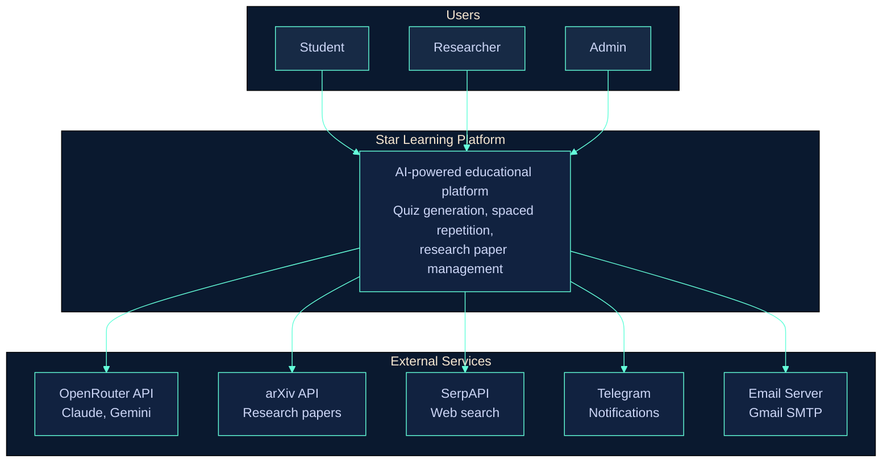

---

## 2. Container Diagram (C4 Level 2) - Main Components

**What's inside the system?** The main parts that work together.

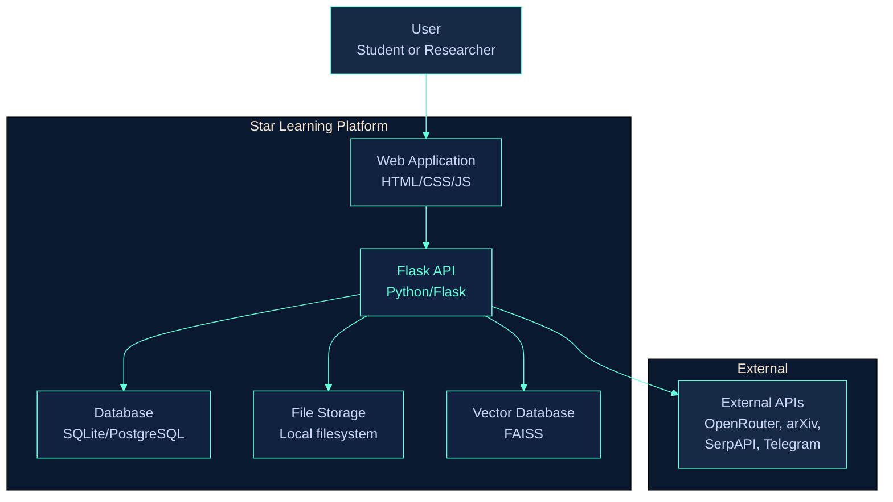

---

## 3. How a Student Uses the Platform - Simple Flow

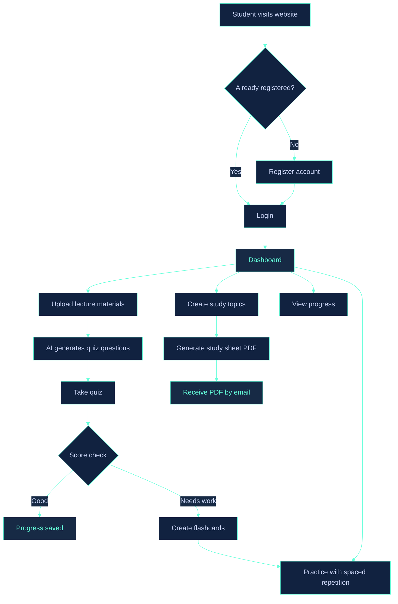

---

## 4. Quiz Generation Flow - Step by Step

**How does the quiz get created?** Follow the flow from top to bottom.

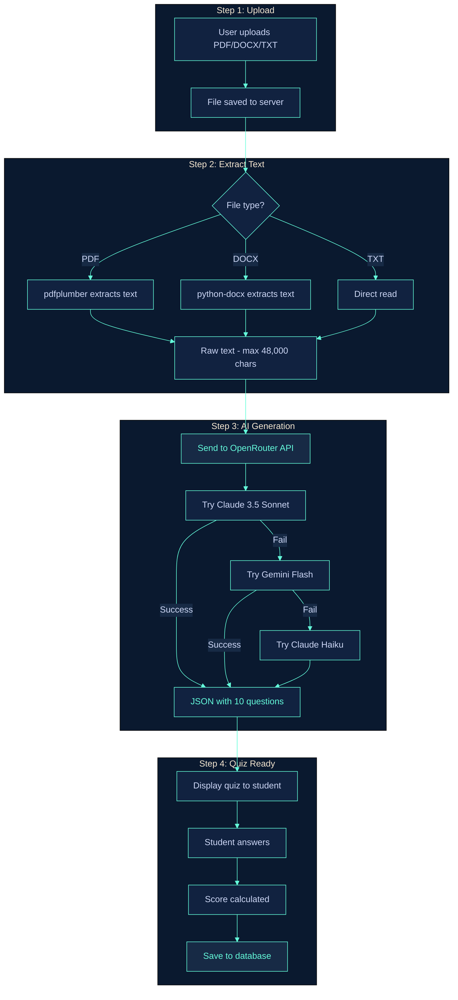

---

## 5. Study Sheet (Fiche) Generation Flow

**How does the PDF study sheet get created?**

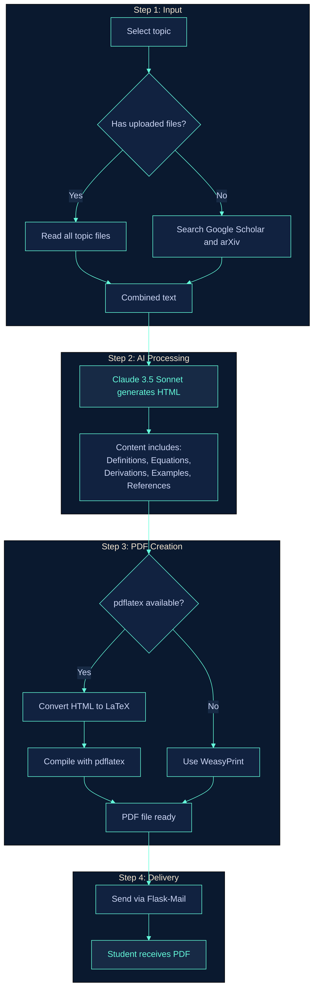

---

## 6. Spaced Repetition (FSRS) System

**How does the app remember what you need to review?**

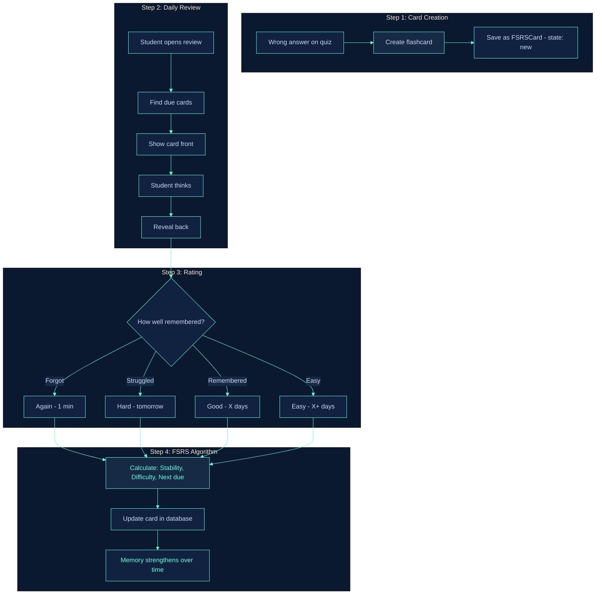

---

## 7. Concept Dependency Graph & Learning Path

**How does the app know what to learn first?**

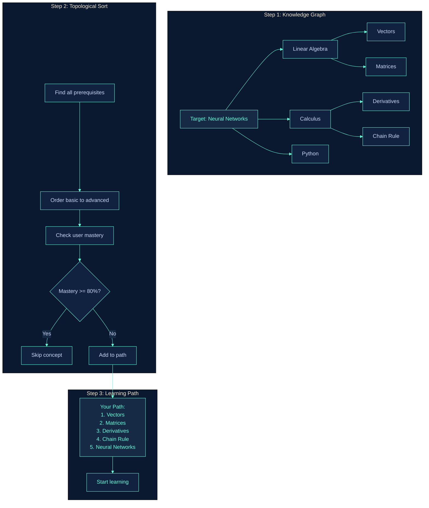

---

## 8. Research Paper Library (For Researchers)

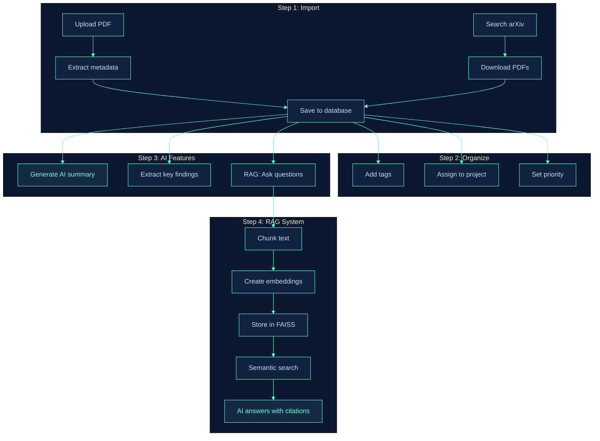

---

## 9. Database Structure - Simplified

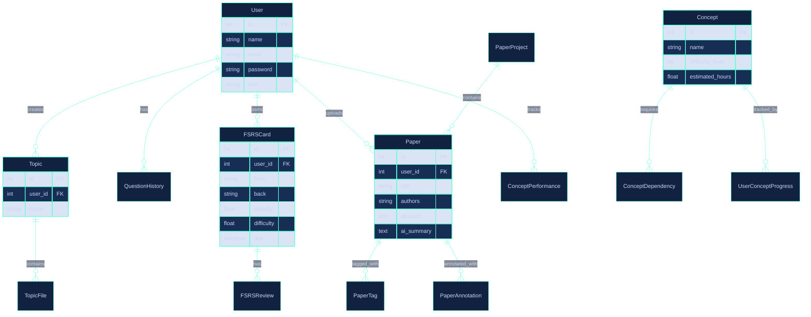

---

## 10. API Endpoints Overview

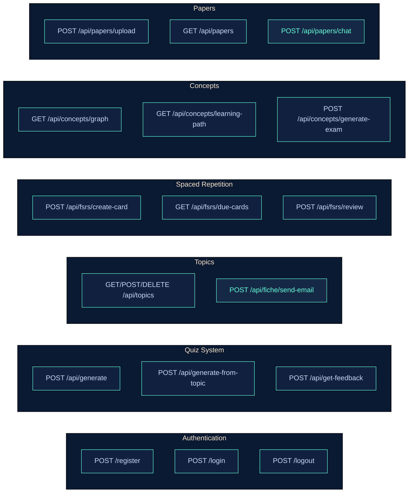

---

## 11. Technology Stack

```mermaid
%%{init: {'theme': 'base', 'themeVariables': { 'primaryColor': '#112240', 'primaryTextColor': '#ccd6f6', 'primaryBorderColor': '#64ffda', 'lineColor': '#64ffda', 'secondaryColor': '#172a45', 'tertiaryColor': '#0a192f'}}}%%
flowchart TD
    APP[Star Learning Platform]

    APP --> FE[Frontend]
    APP --> BE[Backend]
    APP --> DB[Database]
    APP --> AI[AI Services]
    APP --> EXT[External APIs]
    APP --> FILE[File Processing]
    APP --> PDF[PDF Generation]

    FE --> FE1[HTML5/CSS3]
    FE --> FE2[JavaScript]
    FE --> FE3[Galaxy theme]

    BE --> BE1[Flask]
    BE --> BE2[SQLAlchemy]
    BE --> BE3[Flask-Login]
    BE --> BE4[Flask-Mail]

    DB --> DB1[SQLite dev]
    DB --> DB2[PostgreSQL prod]
    DB --> DB3[FAISS vectors]

    AI --> AI1[OpenRouter API]
    AI1 --> AI2[Claude 3.5 Sonnet]
    AI1 --> AI3[Gemini Flash]
    AI1 --> AI4[Claude Haiku]

    EXT --> EXT1[arXiv]
    EXT --> EXT2[SerpAPI]
    EXT --> EXT3[Telegram]

    FILE --> FILE1[pdfplumber]
    FILE --> FILE2[python-docx]
    FILE --> FILE3[pandas]

    PDF --> PDF1[pdflatex]
    PDF --> PDF2[WeasyPrint]

    style APP fill:#172a45,stroke:#64ffda,color:#64ffda
    style FE fill:#112240,stroke:#64ffda,color:#ccd6f6
    style BE fill:#112240,stroke:#64ffda,color:#ccd6f6
    style DB fill:#112240,stroke:#64ffda,color:#ccd6f6
    style AI fill:#112240,stroke:#64ffda,color:#ccd6f6
    style EXT fill:#112240,stroke:#64ffda,color:#ccd6f6
    style FILE fill:#112240,stroke:#64ffda,color:#ccd6f6
    style PDF fill:#112240,stroke:#64ffda,color:#ccd6f6
```

---

## 12. Complete User Flow - The Full Picture

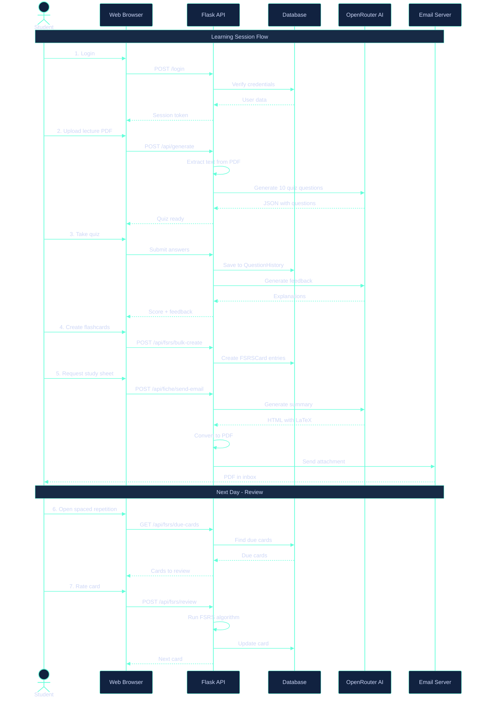

---

## How to Use These Diagrams

1. **View Online**: Go to [mermaid.live](https://mermaid.live), paste any diagram code
2. **Export**: Download as PNG or SVG for presentations
3. **GitHub**: This file renders automatically on GitHub
4. **Presentations**: Export and add to PowerPoint/Google Slides

---

*Created for Star Learning Platform - M1 ML Business Project*
