# Star Learning Platform - Code Flow Diagrams

> **How to view these diagrams:**
> - Copy to [mermaid.live](https://mermaid.live) for instant rendering
> - View directly on GitHub (renders automatically)
> - Export as PNG/SVG from mermaid.live

> **Color Palette (Star Learning Theme):**
> - Primary Accent: #64ffda
> - Dark Background: #0a192f
> - Card Background: #112240
> - Border: #172a45
> - Text: #ccd6f6

---

## 1. Application Initialization Flow

**File: webapp/server.py**

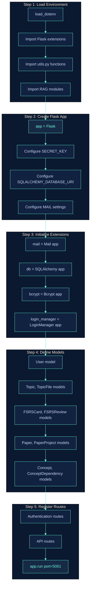

---

## 2. User Authentication Flow

**Files: webapp/server.py - /register, /login routes**

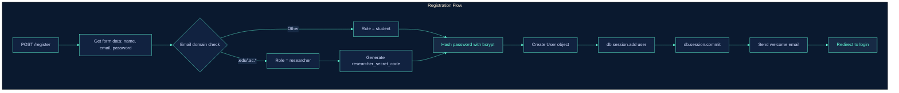

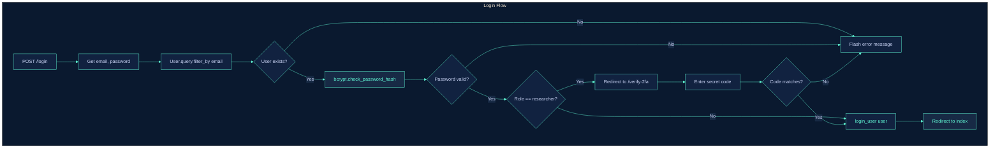

---

## 3. Quiz Generation Code Flow

**Files: webapp/server.py - /api/generate, utils.py - openrouter_generate_questions**

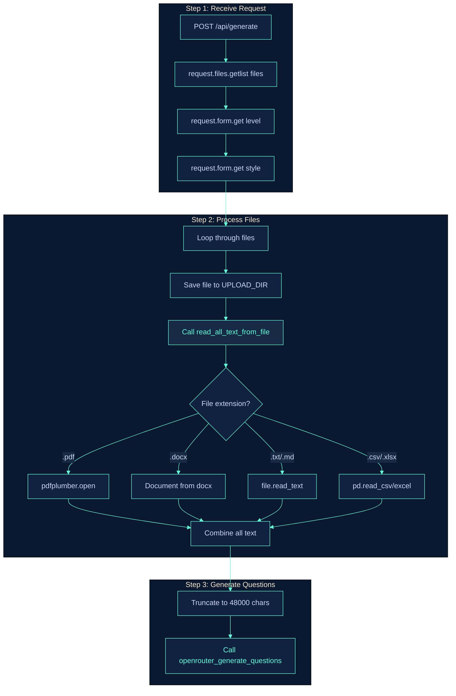

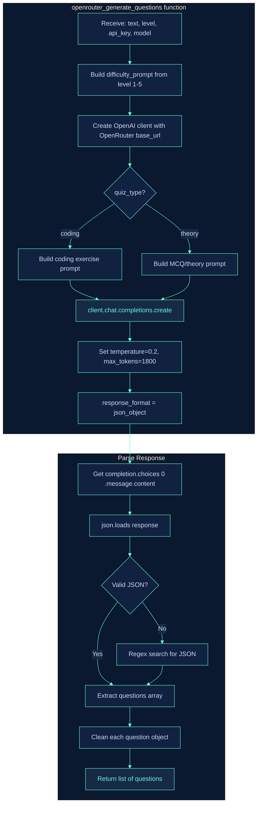

---

## 4. Fiche/Study Sheet Generation Flow

**Files: webapp/server.py - /api/fiche/send-email, utils.py - generate_detailed_summary, create_pdf**

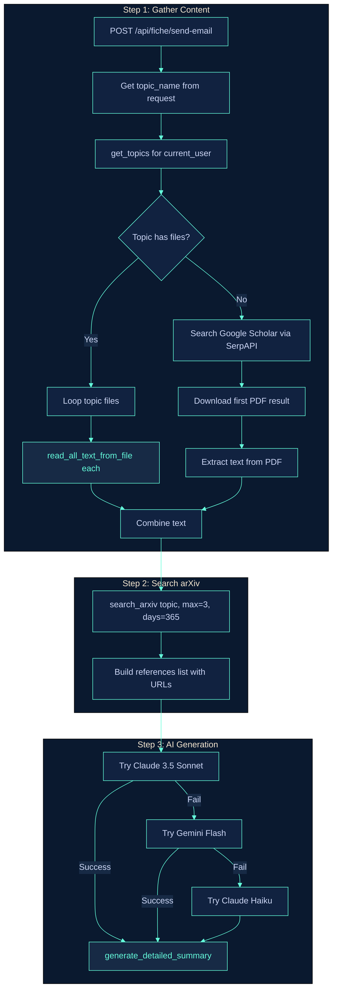

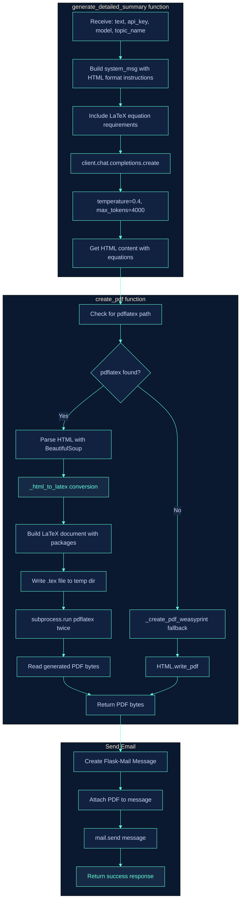

---

## 5. FSRS Spaced Repetition Algorithm Flow

**File: webapp/server.py - fsrs_schedule_card function**

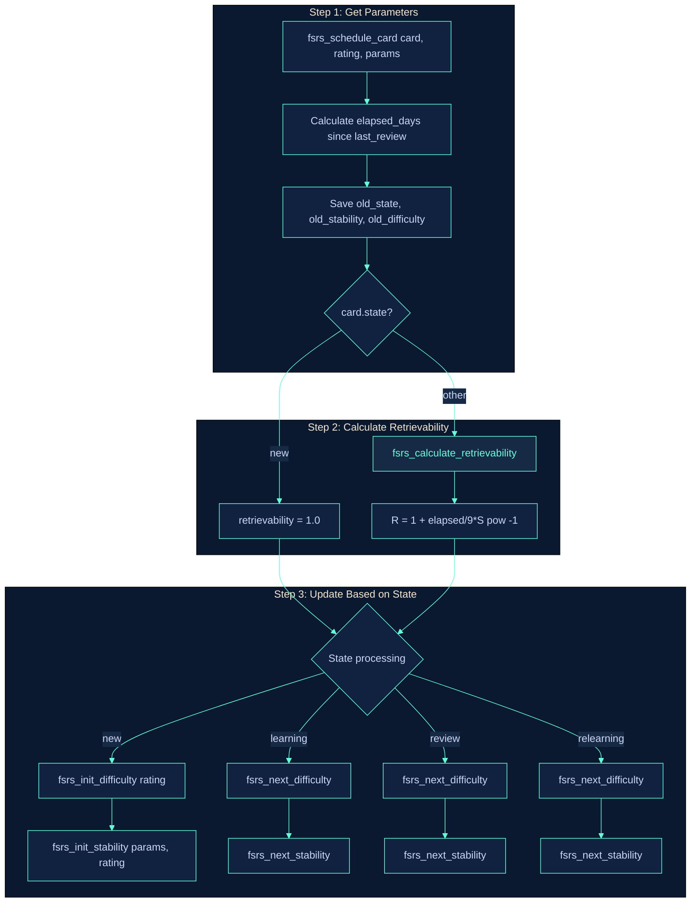

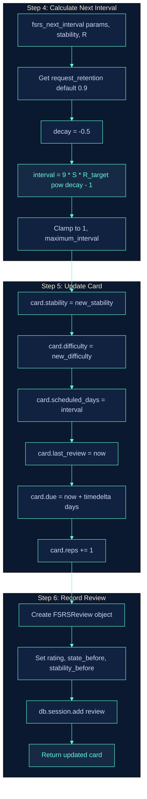

---

## 6. Concept Dependency & Learning Path Flow

**File: webapp/server.py - topological_sort_concepts, generate_learning_path**

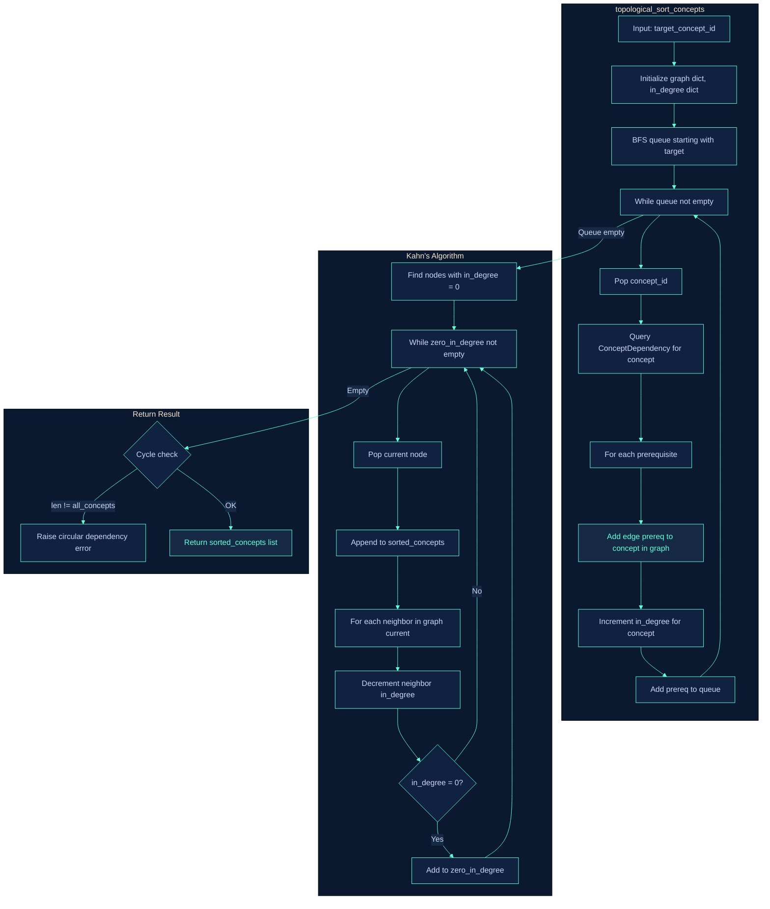

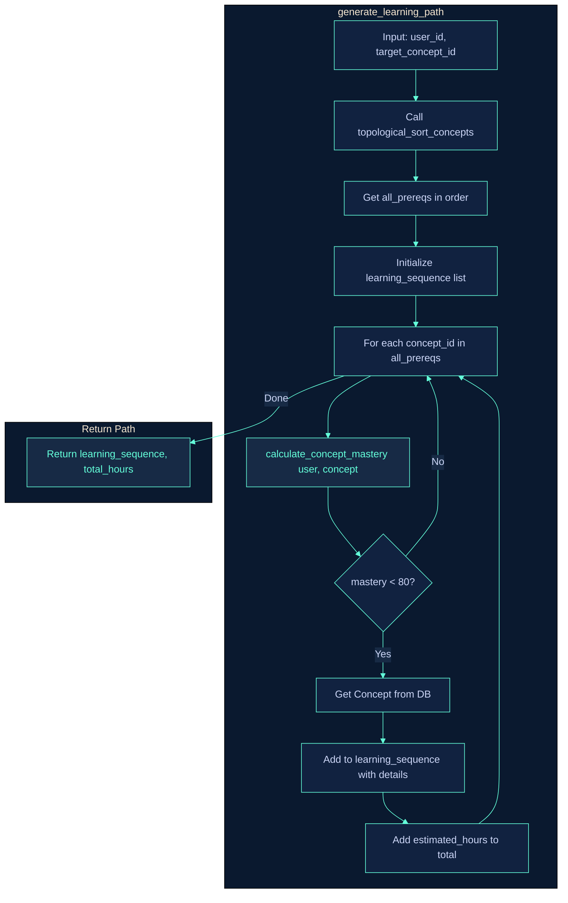

---

## 7. RAG System Flow

**Files: rag_indexer.py, rag_query.py, rag_chunker.py, rag_embeddings.py, rag_vector_store.py**

```mermaid
%%{init: {'theme': 'base', 'themeVariables': { 'primaryColor': '#112240', 'primaryTextColor': '#ccd6f6', 'primaryBorderColor': '#64ffda', 'lineColor': '#64ffda', 'secondaryColor': '#172a45', 'tertiaryColor': '#0a192f'}}}%%
flowchart TD
    subgraph "index_paper_on_upload"
        A[Receive paper_id, file_path] --> B[Extract text with pdfplumber]
        B --> C[rag_chunker: split into chunks]
        C --> D[Chunk size ~500 tokens with overlap]
        D --> E[rag_embeddings: generate vectors]
        E --> F[Use sentence-transformers model]
        F --> G[rag_vector_store: add to FAISS]
        G --> H[Save index with paper metadata]
    end

    style A fill:#112240,stroke:#64ffda,color:#ccd6f6
    style E fill:#172a45,stroke:#64ffda,color:#64ffda
    style H fill:#172a45,stroke:#64ffda,color:#64ffda
```

```mermaid
%%{init: {'theme': 'base', 'themeVariables': { 'primaryColor': '#112240', 'primaryTextColor': '#ccd6f6', 'primaryBorderColor': '#64ffda', 'lineColor': '#64ffda', 'secondaryColor': '#172a45', 'tertiaryColor': '#0a192f'}}}%%
flowchart TD
    subgraph "query_papers"
        A[Receive user query] --> B[Generate query embedding]
        B --> C[FAISS similarity search]
        C --> D[Get top-k relevant chunks]
        D --> E[Retrieve paper metadata for chunks]
        E --> F[Build context from chunks]
        F --> G[Send to Claude with context]
        G --> H[Generate answer with citations]
        H --> I[Return response with paper references]
    end

    style A fill:#112240,stroke:#64ffda,color:#ccd6f6
    style C fill:#172a45,stroke:#64ffda,color:#64ffda
    style G fill:#112240,stroke:#64ffda,color:#ccd6f6
    style I fill:#172a45,stroke:#64ffda,color:#64ffda
```

---

## 8. Skills Analysis Flow

**Files: webapp/server.py - /api/analyze-skills, utils.py - extract_skills_from_cv, extract_skills_from_job_description**

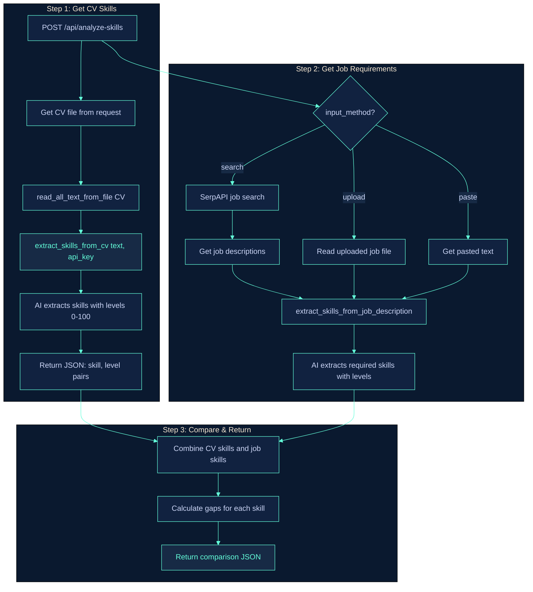

---

## 9. arXiv Search & Telegram Notification Flow

**Files: utils.py - search_arxiv, send_telegram_message**

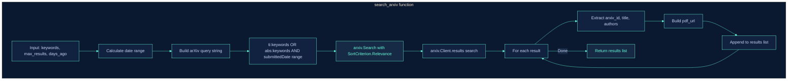

```mermaid
%%{init: {'theme': 'base', 'themeVariables': { 'primaryColor': '#112240', 'primaryTextColor': '#ccd6f6', 'primaryBorderColor': '#64ffda', 'lineColor': '#64ffda', 'secondaryColor': '#172a45', 'tertiaryColor': '#0a192f'}}}%%
flowchart TD
    subgraph "send_telegram_message function"
        A[Input: token, chat_id, message] --> B{Token and chat_id valid?}
        B -->|No| C[Raise ValueError]
        B -->|Yes| D[telegram.Bot token=token]
        D --> E[await bot.send_message]
        E --> F[chat_id, text, parse_mode=Markdown]
        F --> G[Return True on success]
    end

    subgraph "API Route /api/arxiv-search"
        H[POST /api/arxiv-search] --> I[Get keywords, days, max_results]
        I --> J[Get telegram token, chat_id]
        J --> K[Call search_arxiv]
        K --> L[Format results as Markdown]
        L --> M[asyncio.run send_telegram_message]
        M --> N[Return success response]
    end

    style A fill:#112240,stroke:#64ffda,color:#ccd6f6
    style E fill:#172a45,stroke:#64ffda,color:#64ffda
    style K fill:#112240,stroke:#64ffda,color:#ccd6f6
    style N fill:#172a45,stroke:#64ffda,color:#64ffda
```

---

## 10. Database Operations Flow

**File: webapp/server.py - SQLAlchemy operations**

---

## 11. Error Handling & Model Fallback Flow

**File: webapp/server.py, utils.py**

```mermaid
%%{init: {'theme': 'base', 'themeVariables': { 'primaryColor': '#112240', 'primaryTextColor': '#ccd6f6', 'primaryBorderColor': '#64ffda', 'lineColor': '#64ffda', 'secondaryColor': '#172a45', 'tertiaryColor': '#0a192f'}}}%%
flowchart TD
    subgraph "AI Model Fallback Strategy"
        A[Need AI generation] --> B[Define models list]
        B --> C[claude-3.5-sonnet, gemini-flash, claude-haiku]
        C --> D[For model in models]
        D --> E[Try API call]
        E --> F{Success?}
        F -->|Yes| G[Return result, break loop]
        F -->|No| H[Log warning]
        H --> I[Continue to next model]
        I --> D
        D -->|All failed| J[Return error response]
    end

    subgraph "Rate Limit Handling"
        K[API returns 429] --> L[Log rate limit error]
        L --> M[Try next model in list]
        M --> N[If all models fail]
        N --> O[Return user-friendly error]
        O --> P[Suggest waiting 10-15 minutes]
    end

    style A fill:#112240,stroke:#64ffda,color:#ccd6f6
    style E fill:#172a45,stroke:#64ffda,color:#64ffda
    style G fill:#112240,stroke:#64ffda,color:#64ffda
    style J fill:#172a45,stroke:#64ffda,color:#ccd6f6
```

---

## How to Use These Diagrams

1. **View Online**: Go to [mermaid.live](https://mermaid.live), paste any diagram code
2. **Export**: Download as PNG or SVG for presentations
3. **GitHub**: This file renders automatically on GitHub
4. **Code Reference**: Use alongside source code for understanding

---

*Created for Star Learning Platform - M1 ML Business Project*
